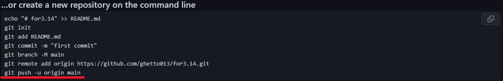

## git push
---
git push - команда для отправки изменений в репозиторий.

Далее также можно скопировать текст подсказки от *GitHub*:



**Напоминаем, что этот текст можно взять из поля с подсказками от ***GitHub*** из пункта** [Создание нового проекта](./new%20project.md).

После чего вставляйте в терминал:

```bash=
git push -u origin main
```

Можете написать другое имя основной ветки, например, *master*.

[Назад](./readme.md)