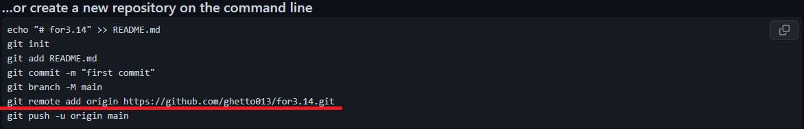

## git remote
---
Далее требуется указать удалённый путь до репозитория, который мы создали.
Для этого копируем ссылку, которую указал нам *GitHub*:



**Напоминаем, что эта ссылка из поля с подсказками ***GitHub*** из пункта** [Создание нового проекта](./new%20project.md).

Затем вставляем команду git remote в терминал:

```bash=
git remote add origin [ссылка]
```

Теперь VS code знает путь отправления файлов.

[Назад](./readme.md)